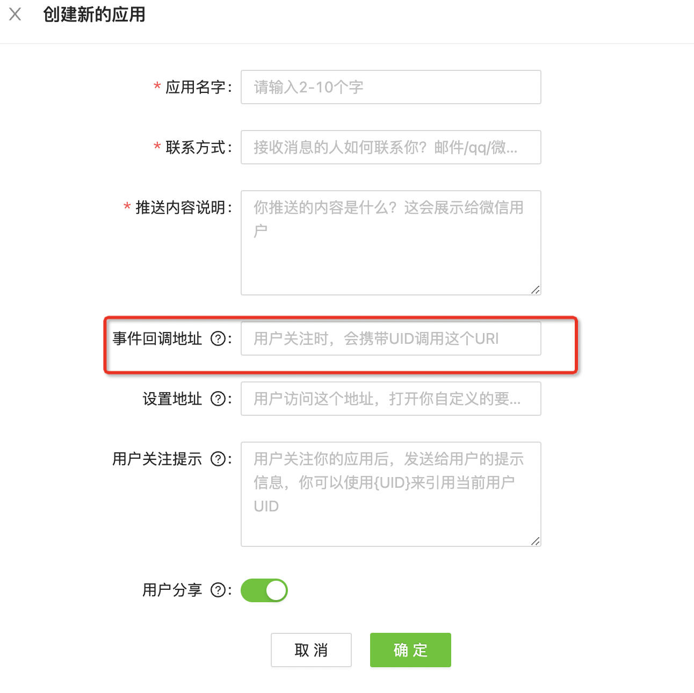

# 饱了吗登录面板

### 配置文件说明

| 字段          | 说明                               | 示例                   |
| ------------- | ---------------------------------- | ---------------------- |
| web_port      | 面板端口                           | 8080                   |
| hostname      | 青龙地址                           | http://baidu.com:8080/ |
| client_id     | 青龙key                            | 123                    |
| client_secret | 青龙secret                         | 123                    |
| name          | 环境变量名称                       | elmck             |
| disabled      | 是否禁用`true:禁用，false：不禁用` |                        |
| carmi         | 卡密                               |                        |
| appToken | wxpush 平台创建应用获取到的 token | AT_l2zR8LFfpdPUtaKNrVI3yBjRWyF9MaXx |
| masterUid | 自己wxpush获取到的 uid | UID_DuwWenFrtHHErABc1qF4zlGDcXxx |

### 使用说明

#### 一键Docker部署命令[（网友提供）](https://hub.docker.com/r/jackytj/eleweb)
```shell
docker run -itd --name eleWeb -p 8080:8080 -v $PWD/eleWeb:/root/eleWeb --restart=unless-stopped jackytj/eleweb
```

#### 一键升级命令
```shell
docker run --rm -v /var/run/docker.sock:/var/run/docker.sock containrrr/watchtower -cR eleWeb
```

**注意📢** **注意📢** **注意📢**

启动失败是因为没有正确配置config.json文件，config.json文件位置在用户目录下的eleWeb文件夹下，配置后重新启动容器即可。

#### 不使用docker

1. 下载对应的执行文件和config.json文件并放在同一目录

2. 再config.json文件中填写配置信息

3. 启动可执行文件

   ```shell
   ./eleWeb-linux-x64
   ```

   后台运行命令

   ```shell
   nohup ./eleWeb-linux-x64 &
   ```

   pm2守护进程启动

   ```shell
   pm2 start ./eleWeb-linux-x64
   ```

4. 停止运行

   查询进程信息

   ```shell
   ps -ef|grep eleWeb
   ```

   杀死进程

   ```shell
   kill -7 PID
   ```

### 常见问题

```shell
TypeError: Cannot read properties of null (reading '2')
at Object.<anonymous> (/snapshot/ele_test/update.js)
at Module•-sompile (pkB/prelude/bootstrap. j5:1930:22)
at Module:_extensions..js (node sinternal/modules/cjs/loader :1166:10)
```

出现上面的错误，解决方法是青龙 url 后加`/`。

- 启动成功却访问不了

  检查 docker 的端口映射，前面的端口是访问页面的端口，后面的端口要和config.json 里面的端口保持一致。

### wxpush 对接教程

1. 到 [xwpush 管理后台](https://wxpusher.zjiecode.com/admin/)创建应用

   

   **回调地址务必填写正确，否则获取不到用户 uid，导致推送失败**，格式：短信面板地址+/api/wxpusher，如 http://card.94wan.fun:92/api/wxpusher。可以访问回调地址验证下，出现如下界面则说明回调地址正确。

   

1. 将创建应用获得的 apptoken填入配置文件

3. 将自己的 uid 填入配置文件（会收到别人登录通知），[参考获取 uid](https://wxpusher.zjiecode.com/docs/#/?id=%e8%8e%b7%e5%8f%96uid)


### 最后

有问题到飞机频道：[https://t.me/tigerorrose](https://t.me/tigerorrose)讨论

## 免责声明

请勿将本仓库内的任何内容用于商业或非法目的，否则后果自负.

如果任何单位或个人认为该项目的脚本可能涉嫌侵犯其权利，则应及时通知并提供身份证明，所有权证明，我将在收到认证文件后删除相关脚本.

作者对任何本仓库中包含的脚本在使用中可能出现的问题概不负责，包括但不限于由任何脚本错误导致的任何损失或损害.

您必须在下载后的24小时内从计算机或手机中完全删除以上内容.

任何以任何方式查看此项目的人或直接或间接使用该项目的任何脚本的使用者都应仔细阅读此声明。作者保留随时更改或补充此免责声明的权利。一旦使用并复制了任何本仓库相关脚本或其他内容，则视为您已接受此免责声明.

### 本仓库之中所有脚本配置纯属自用备份
